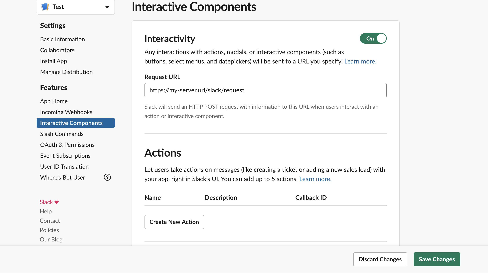
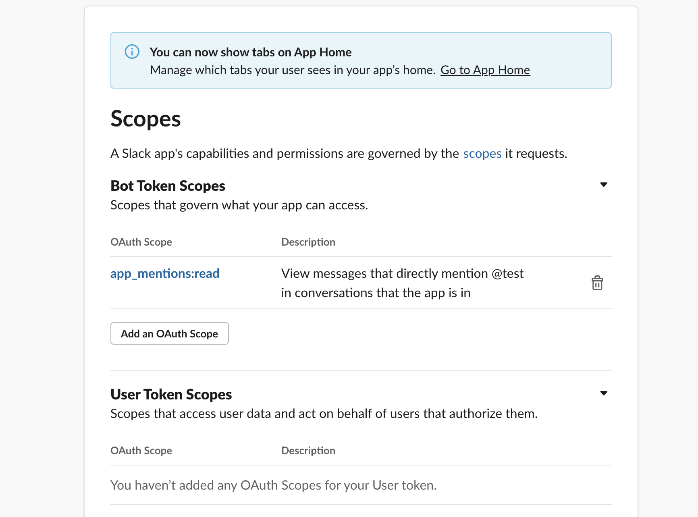
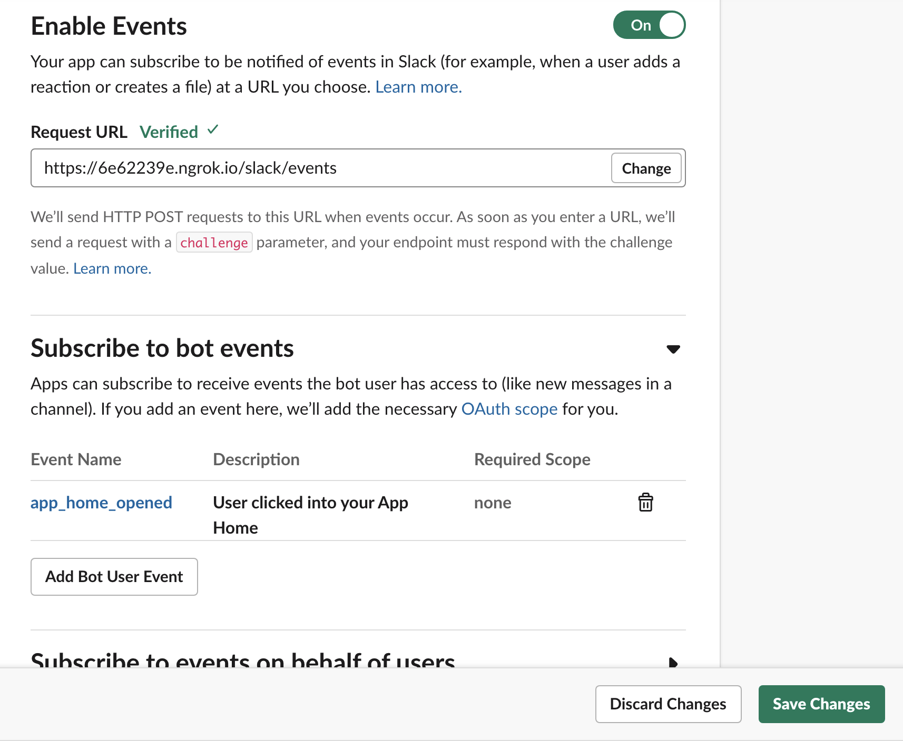
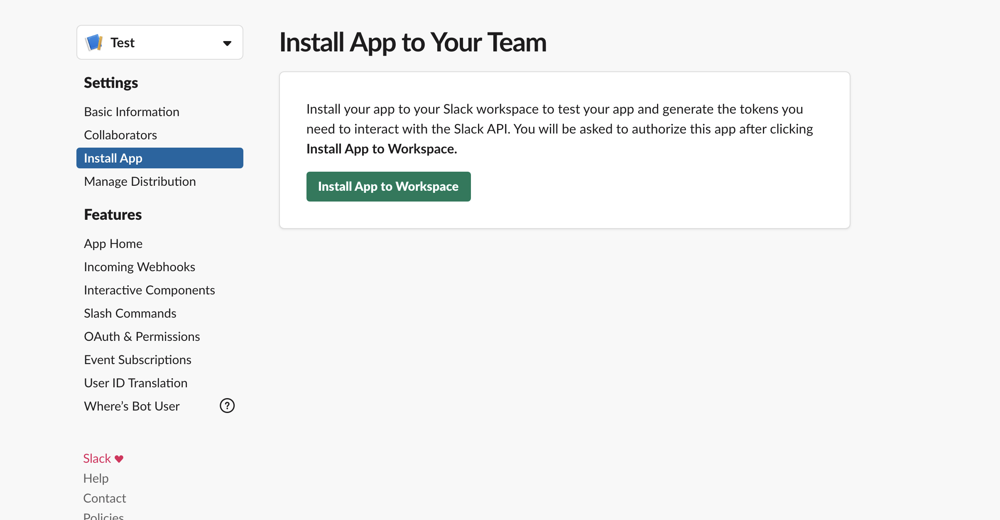
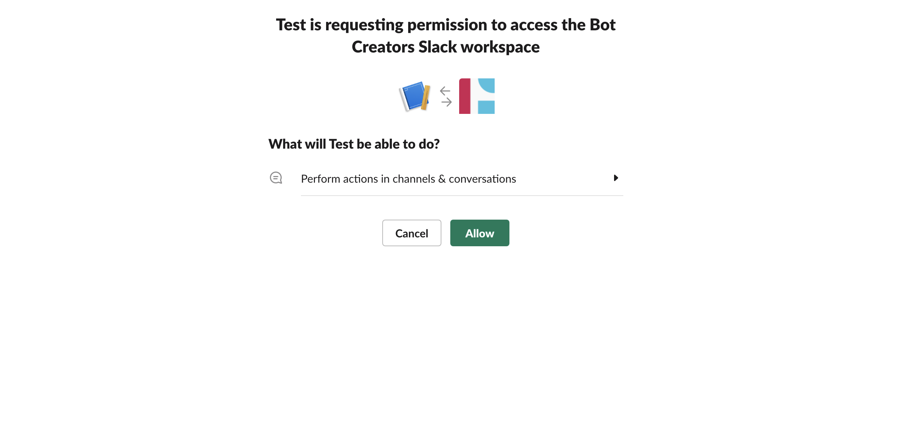
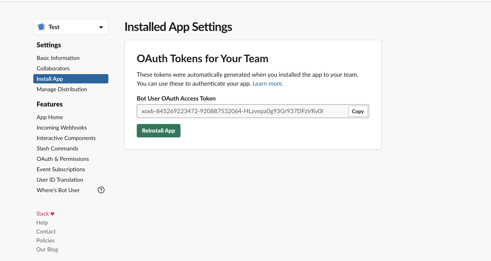
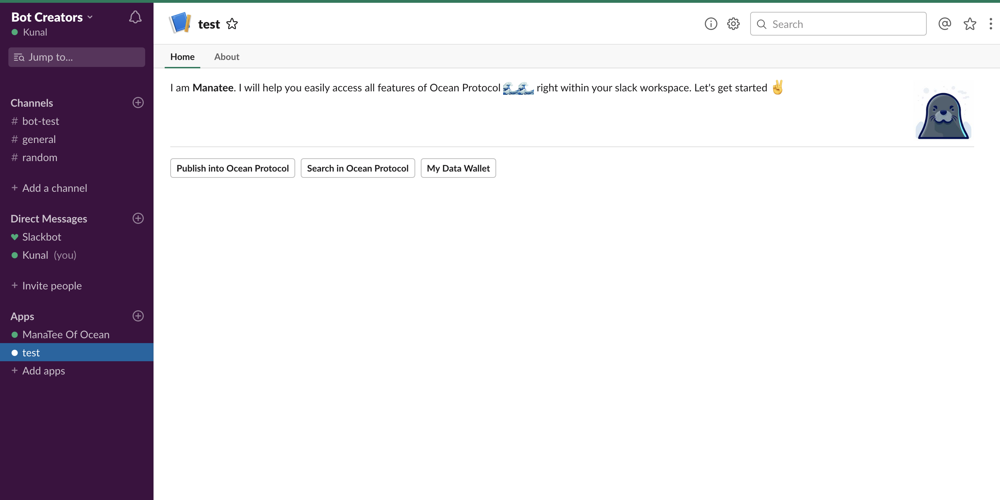

### This is a step by step instructions to install manatee to your slack workspace

#### Requirements
 
 - You have a slack user account and are logged into slack
 - You are admin and have rights to install bots in your workspace
 - Manatee app server is up and running (for e.g. at https://my-server.com)
 

### Step 1

##### Go to [https://api.slack.com](https://api.slack.com) and click on "Start Building" button. In "Create Slack app" give it a name (e.g. ManaTee) and select your workspace and click "Create App" button

### Step 2

##### Click on "Interactive Components" link in the sidebar. Turn ON interactivity (if disabled) and fill manatee server url in Request URL input field like this - **https://my-server.com/slack/request** and save changes.

### Step 3 

##### Click on "OAuths & Permisssions" link in the sidebar under Features. Scroll down to Scopes section. In Bot Scopes, add "apps-mentions:read" scope and save changes. 

### Step 4

##### Click on "App Home" link in the sidebar under Features. **Enable** button to "Show my bot always online" and then **enable** App Home button and **disable** Message button. 

### Step 5

##### Click on "Event Subscriptions" link in the sidebar under Features. Enable Events button. In the Request URL, enter  **https://my-server.com/slack/events** (change host name accordingly). In "Subscribe to bot events" section, add event "app_home_opened" and save changes.

### Step 6

##### Under Settings section of sidebar, click on "Install App" and then click on "Install App to Workspace" (You might need admin rights for this activity)

### Step 7

##### When Slack requests permission to install app, Click on "Allow" button.

### Step 8

##### This is final step. Once your app is installed, you will get bot token. This is needed for our Manatee server to communicate with our Manatee slack app. So, copy this token and paste it in .env file of our server in TOKEN variable. Then restart the server. 

##### That's it. Congratulations!! You now have a working Manatee slack app. 
##### To use it, go to your workspace and look at the sidebar in apps section. Click on our app and you will see App Home.

